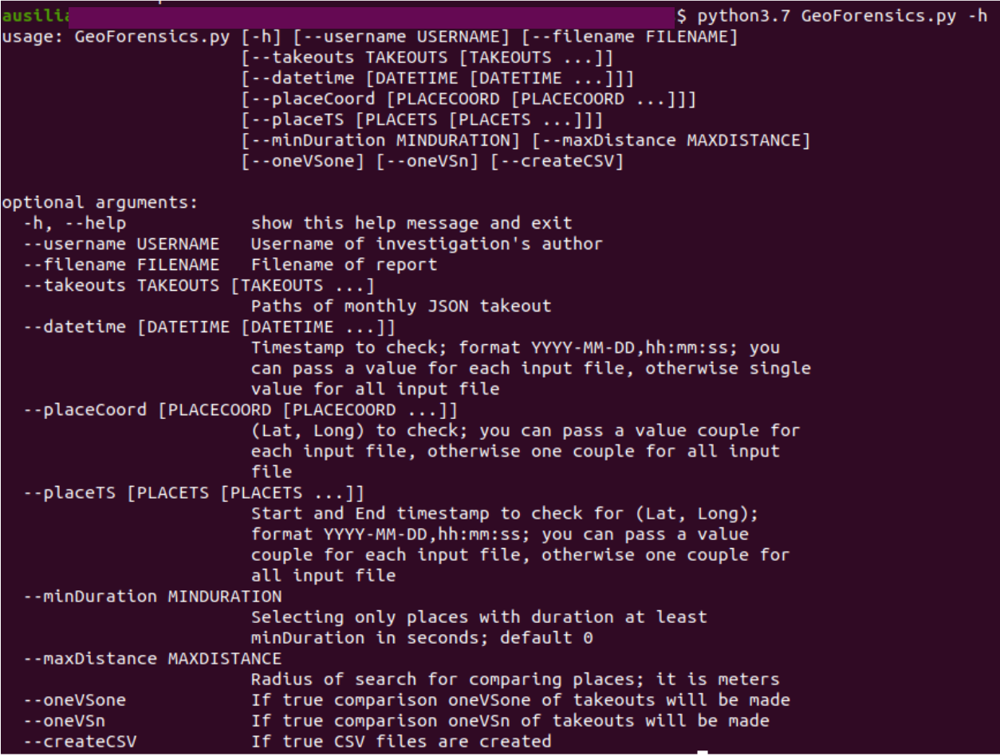

# Google Takoeut Forensics

This software works with Google Takeout based semantic location history.  
There are two types of location history:
- monthly: it is analyzed here;
- only one global.  
  
The user through CLI Interface can upload one or more monthly JSON takeout and ask to parse the location history, to search some place in some times, some meetings 1vs1 and 1vsN.  
The software is forensics compliant and so it generates a report containing all actions made on data. Moreover, the user can choose to generate CSV files.  

## Requirements
`python 3`  
`mdutils`  
`pandoc`

## Structure
The software has object structure:
- GeoForensics: it is the "master" object that coordinates all parts;
- SegmentParser: it is the "core" of the software because it contains all code for takeout analysis;
- ReportMaker: it generates and manage the PDF report; first it creates Markdown file and then it converts to PDF file;
- CSVMaker: it generates and manage CSV attachments.

## Usage
`python3.7 GeoForensics.py --username YourName --filename ProjectName --takeouts paths/of/one/or/more/monthly/JSON --datetime TimestampToCheck --placeCoord LatLongToCheck --placeTS TimestampToCheckForLatLong --minDuration DurationOfVisit --maxDistance RadiusOfSearch --oneVSone --oneVSn --createCSV`
  

